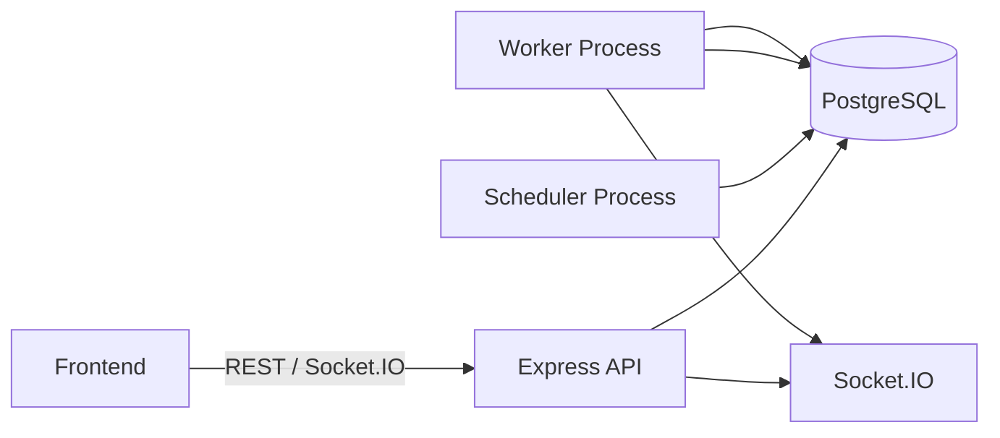

# Architecture

## Overview

The system is organized as a multi-process scheduler platform.

- The API server exposes REST endpoints, JWT authentication, Socket.IO updates, and dashboard data.
- The worker process continuously claims due jobs and executes them concurrently.
- The scheduler process promotes delayed jobs and fires recurring cron schedules.
- PostgreSQL stores the canonical state through Prisma ORM.

## Main Flow

## Core Responsibilities

- Authentication: register, login, JWT verification, RBAC checks.
- Tenancy: organizations, projects, and queues.
- Scheduling: delayed jobs, scheduled jobs, and recurring cron jobs.
- Execution: claim, run, retry, dead-letter handling, and execution logs.
- Observability: worker heartbeats, queue health, dashboard metrics, and live updates.

## Runtime Notes

- The API server and worker processes are intentionally separate so workers can scale horizontally.
- Scheduler tasks are stored in PostgreSQL and rehydrated on startup.
- Socket.IO broadcasts job and worker events to the frontend dashboard.
